# [**Blockhaus - Besucher Tracker**](https://github.com/Garbaz/blockhaus-scrape)

<!--  

# Heute
## *Heutiger Verlauf*
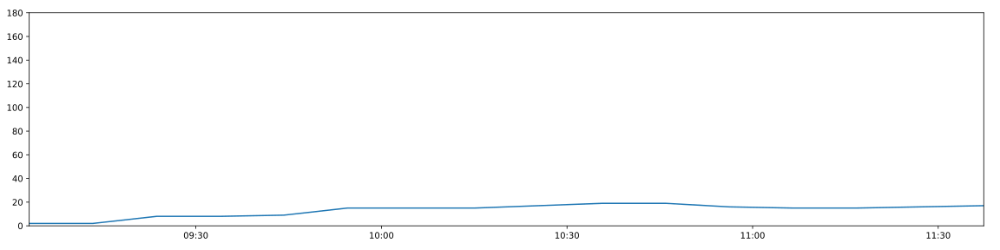
 

## *Durchschnittlicher Verlauf für heutigen Wochentag*
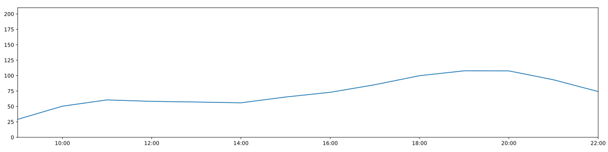

  -->

<!-- # Woche -->

<!-- ## *Verlauf der aktuellen Woche*
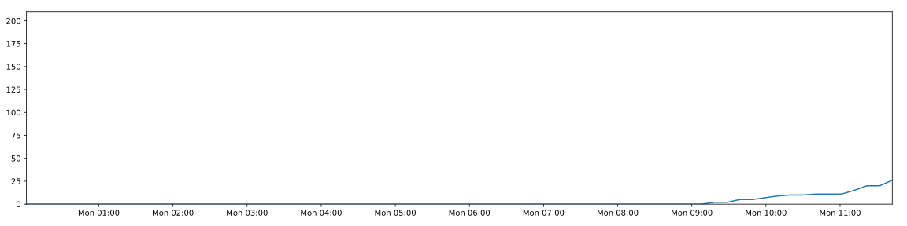 -->

## *Durchschnittlicher Wochenverlauf*
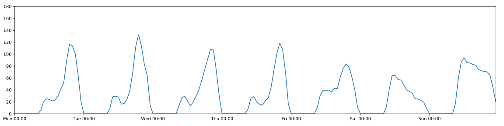

 

<!-- # Wochentage -->

## *(Durchschnittlicher Tagesverläufe)*

### **Montag**

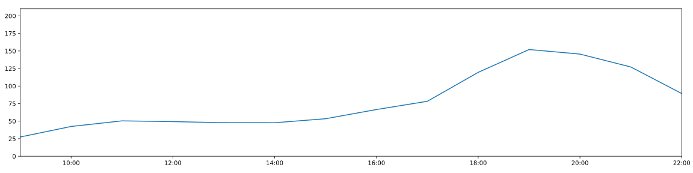

### **Dienstag**

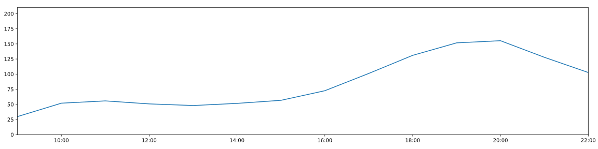

### **Mittwoch**

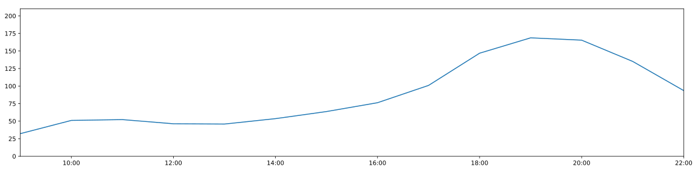

### **Donnerstag**

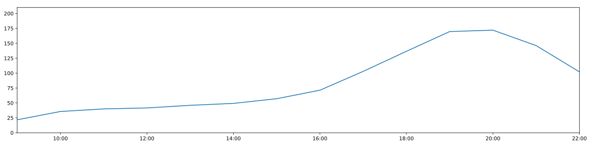

### **Freitag**

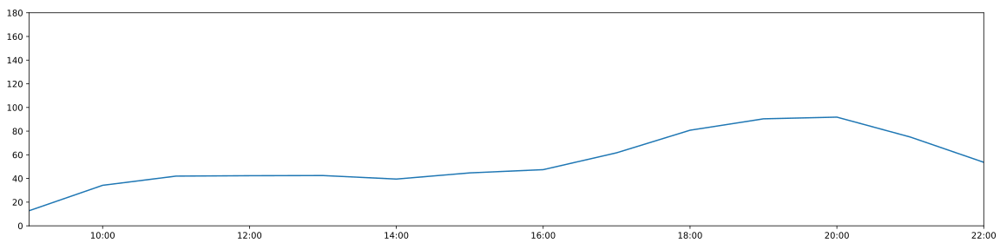

### **Samstag**

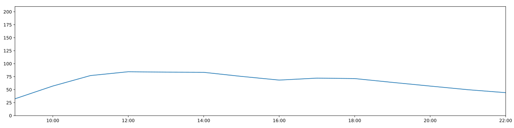

### **Sonntag**

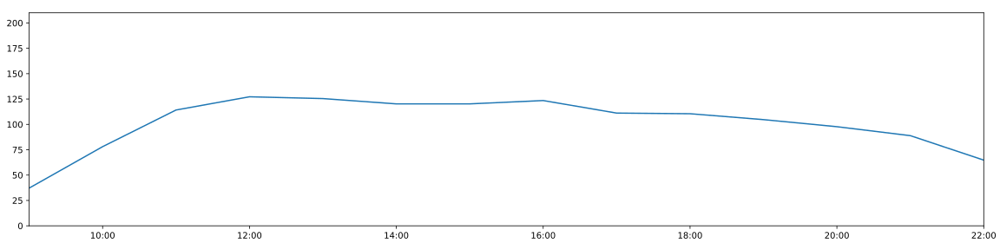

  

