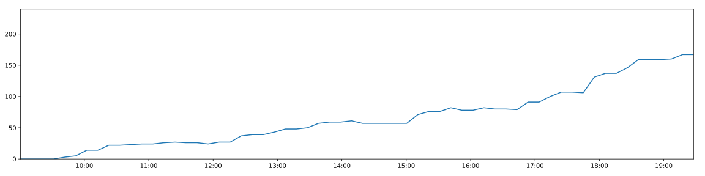
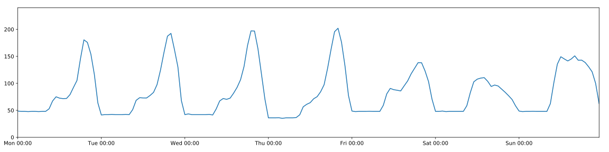
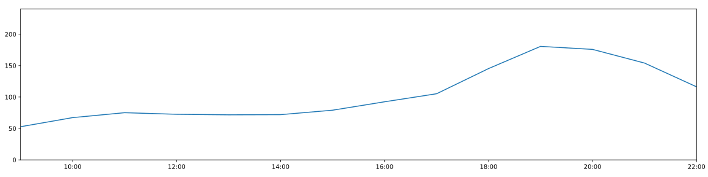
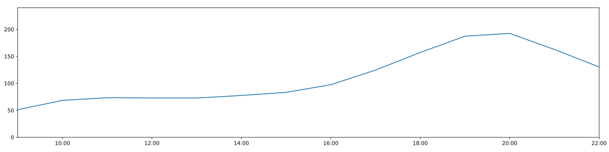
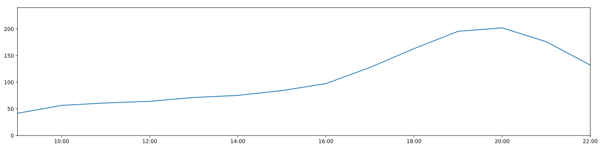
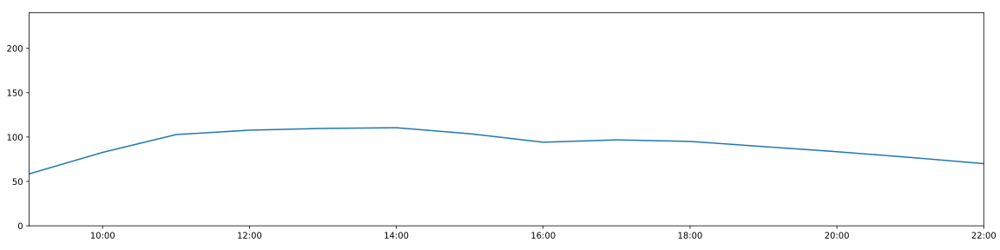

# **Blockhaus - Besucher Tracker**

 

# Heute
## *Heutiger Verlauf*

 

## *Durchschnittlicher Verlauf für heutigen Wochentag*

 

# Woche

## *Verlauf der aktuellen Woche*

## *Durchschnittlicher Wochenverlauf*

 

# Wochentage

### *Durchschnittlicher Tagesverlauf an einem...*

#### **Montag**

#### **Dienstag**

#### **Mittwoch**

#### **Donnerstag**

#### **Freitag**

#### **Samstag**

#### **Sonntag**

